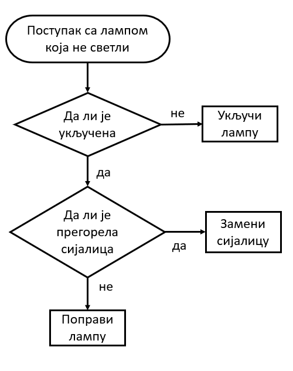
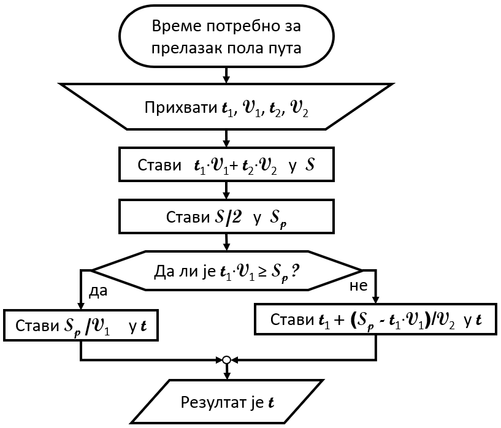

Записивање алгоритма
====================

Први алгоритми су били описивани помоћу примера, користећи обичан говорни језик. Оваква задавања алгоритама зовемо **неформалним** и током дугог времена то је било довољно, поготово за мање осетљиве поступке. Ако неки детаљ и није био сасвим објашњен, здравим разумом се могло закључити како треба спроводити поступак у таквим случајевима.

Како су људи почињали да се баве све комплекснијим стварима, тако се све више осећала потреба за већом прецизношћу у изражавању алгоритама. При слободнијем тумачењу поступка код тешких и мање познатих проблема постоји ризик да се недовољно прецизан поступак погрешно протумачи. Када је реч о важном и скупом поступку, недопустиво је да исход спровођења алгоритма зависи од нечијег тумачења, намера, воље и слично. Испоставило се да, исто као и у математици и другим људским делатностима, обичан језик није довољно прецизан за овакву употребу, па је за даљи развој алгоритмике било неопходно да се развије **формалан начин изражавања (записивања) алгоритама**. 

Формализам у изражавању алгоритама је отворио пут ка оспособљавању машина за извршавање тих алгоритама. Машине се не упуштају у тумачење нејасних делова, оне се чак граде тако да уопште не почињу да извршавају "алгоритам" који им је дат, ако у том "алгоритму" постоји макар и најмањи нејасан део (ако постоји нејасан део, онда то и није алгоритам). Зато је потреба за потпуном прецизношћу и формалним записом алгоритама нарочито порасла током двадесетог века, што је утицало и на нагли развој алгоритмике и рачунарства уопште.

При формалном начину изражавања се користе формуле и симболи са прецизно одређеним значењем. Ако се и користе речи говорног језика, њима је такође додељено поптуно одређено значење, које се може прилично разликовати од уобичајеног, непрецизног, заснованог на општем разумевању језика. Као што се у математици тачно зна шта је таутологија, и значење те речи није исто као у нпр. филозофији или књижевности, тако се у алгоритмици зна шта значе речи циклус, функција или речник.

Начини изражавања и записивања алгоритма
----------------------------------------

Природан језик
''''''''''''''

Свакако први и најједноставнији начин изражавања алгоритама су били природни језици, о чему је већ било говора. Предност овог начина је што не захтева посебну обуку или припрему, али велика мана му је недовољна прецизност.

Дијаграм тока
'''''''''''''

Дијаграм тока (енгл. *flowchart*) служи да сликовито представи процес рада током решавања оређеног проблема. Састоји се од блокова различитог облика, повезаних стрелицама, као у примеру на следећој слици. У сваком блоку се налази текст који описује један корак (активност) у решавању проблема, а сваки облик оквира има посебно значење.

Тако на пример, почетни блок који садржи назив поступка има овални облик, блокови у облику ромба или шестоугла садрже питања, а блокови у облику правоугаоника садрже акције. Овај начин представљања поступака је лако разумљив, а прецизнији је од говорног језика. Популаран је међу људима који обављају техничке послове, а не баве се нужно и програмирањем (инжењери разних струка, организатори посла, вође тимова). Дијаграм тока може да буде мање или више детаљан и прецизан, у складу са потребама.

Дијаграми тока су ушли у употребу 1920-тих година у САД и тада још нису имали везе са програмирањем. Са развојем програмских језика пар деценија касније постали су популарни и у овој области. Програмски језици 1950-тих и 1960-тих (Фортран, Бејсик, Кобол...) су и даље били прилично тешки за читање и разумевање, мада знатно читљивији од претходних. Зато је чак и инжењерима било потребно да осим програмом, алгоритме представе и на неки лакше читљив начин. Касније, са појавом модернијих програмских језика, читање и писање кода је постало једноставније па је значај и популарност овог сликовитог начина приказивања алгоритма данас међу програмерима много мања него раније.

У следећем примеру ћемо употребити дијаграм тока за приказ прецизног поступка решавања једног задатка.

.. questionnote::

    **Пример - пола пута**
    
    Ђура је прво током :math:`t_1` секунди возио брзином :math:`v_1 {m \over s}`, а затим током :math:`t_2` секунди возио брзином :math:`v_2 {m \over s}`. Колико времена је требало Ђури да пређе половину пута који је прешао?

За решавање овог задатка треба прво одредити укупан пређени пут, а то је :math:`s = t_1 \cdot v_1 + t_2 \cdot v_2`. Половину укупног пута можемо да означимо са :math:`s_p = {s \over 2}`. Затим треба проверити да ли је Ђура у првих :math:`t_1` секунди прешао бар половину пута. Ако јесте, тј. ако је :math:`t_1 \cdot v_1 \ge s_p`, онда је тражено време :math:`s_p \over v_1`. У противном је тражено време једнако :math:`t_1 + {{s_p - t_1 \cdot v_1} \over v_2}`.

Поступак решавања овог задатка може да се прикаже следећим дијаграмом тока:

Псеудо-код
''''''''''

Псеудо-код је још један популаран начин изражавања алгоритама. Прецизнији је и зато погоднији од природног језика, али није потпуно прецизан. Погодан је за размену идеја међу људима, односно за учење и стицање опште представе о неком алгоритму без улажења у све техничке детаље који су потребни за његово извршавање (поготово када треба да га извршава машина). Зато псеудо-код може да буде користан у настави, нарочито код ученика са искуством (нпр. студенти) када намера излагача није да се алгоритам изврши, него да се разуме основна идеја. Додавање неопходних детаља би у тим ситуацијама замаглило основну идеју и одвукло пажњу на детаље са којим се слушаоци могу и сами снаћи уз додатан труд.

Псеудо-код може да буде мање или више детаљан и прецизан, у складу са потребама у сваком конкретном случају.

Када решавамо неки проблем, псеудо-код може да буде од помоћи у почетној фази решавања, када проблем разлажемо на једноставније целине, које затим даље разрађујемо. Тако прва верзија записа идеје у псеудо-коду може да представља само грубе црте поступка, а затим да се постепено додају детаљи, све до потпуне формализације и преласка на прави програмски код.

Примера ради, поступак са лампом која не светли, који је претходно представљен дијаграмом тока, може се помоћу псеудо кода изразити овако (ово је један од начина):

.. code::

    ако лампа није укључена
        укључи лампу
    иначе, ако је сијалица прегорела
        замени сијалицу
    иначе
        поправи лампу

Поступак решавања задатка о половини пута може се на овај начин представити псеудо-кодом:

.. code::

    прихвати податке t1, V1, t2, V2
    стави (t1 V1) + (t2 V2) у S
    стави S/2 у Sp
    ако је t1 V1 веће или једнако од Sp
        стави Sp / V1 у t
    иначе
        стави t1 + ((sp - t1 V1) / V2) у t
    резултат је t

Програмски језик
''''''''''''''''

Програмски језици су, као што знамо, развијени да би људи могли на тим језицима да пишу формална упутства за машине. Таква формална упутства за машине се називају програми. Данас постоји око 700 програмских језика, од тога око 250 значајних. Програми написани на неком од програмских језика представљају најпрецизнији (потпуно прецизан) начин изражавања алгоритама и једино они се користе за задавање поступака машинама. Остали начини записивања алгоритама служе само за међуљудску комуникацију, али то не значи да програми служе само за комуникацију човека и машине. Програмски језици су значајно еволуирали током деценија и постали лакши за читање, писање и разумевање, тако да сада није необично да се програми користе и за саопштавање алгоритама другим људима. Осим тога, пошто програмирање углавном није индивидуални посао, програмски код који је писао један човек врло често читају, допуњавају или преправљају други људи.

Као пример еволуције програмских језика, погледајмо како би један исти задатак био решен на језику *FORTRAN*, у верзији тог језика која је била актуелна током 1960-тих година, а затим и решење на језику Пајтон (*Python*), који је актуелан данас. Задатак се састоји у томе да се учита цео број *N*, а затим *N* реалних бројева и да се испише средња вредност учитаних бројева након одбацивања једне најмање и једне највеће вредности од *N* учитаних. На пример, ако се учитава пет реалних бројева 2.5, 3.1, 3.6. 3.8, 3.8, треба исписати број 3.5 јер је то просек бројева 3.1, 3.6. и 3.8 (бројеви не морају да се учитавају редом по величини).

Решење на Фортрану:

.. code-block:: fortran

      READ(5,501) N
  501 FORMAT(I5)
      READ(5,502) A
  502 FORMAT(F5.2)
      ZBIR = A
      ANAJVECI = A
      ANAJMANJI = A
      DO 20 I = 2, N
      READ(5,502) A
      ZBIR = ZBIR + A
      IF (ANAJMANJI .LE. A) GO TO 10
      ANAJMANJI = A
   10 IF (ANAJVECI .GE. A) GO TO 20
      ANAJVECI = A
   20 CONTINUE    
      PROSEK = (ZBIR-ANAJMANJI-ANAJVECI) / (N-2)
      WRITE(6,601) PROSEK
  601 FORMAT(F10.2)
      STOP
      END 

Решење на Пајтону:

.. code-block:: python

    n = int(input())
    a = int(input())
    zbir = najmanji = najveci = a
    for i in range(n-1):
        a = int(input())
        zbir = zbir + a
        if (najmanji > a): najmanji = a
        if (najveci < a): najveci = a
    print((zbir - najmanji - najveci) / (n - 2))

Ако се допусти заузимање више меморије (што у данашње време великих меморија више и није проблем), на Пајтону се може написати још компактније решење:

.. code-block:: python

    n = int(input())
    a = [int(input()) for i in range(n)]
    print((sum(a) - min(a) - max(a)) / (n - 2))

Осим што је дужи, програм на Фортрану је и тежи за разумевање. Зато не чуди да је програмирање дуго било дисциплина само за инжењере, односно људе са израженим способностима за технику, који су способни да се служе компликованим формалним записима. Овде се нећемо бавити Фортраном као језиком, али смо желели да илуструјемо како је изгледало програмирање пре неколико деценија. Пример је још упечатљивији када се има у виду да су тадашњи програмери били срећни што више не морају да пишу програме на симболичком језику (енгл. *assembly language*, код нас познат и под жаргонским називом "асемблер"), који се разликује од рачунара до рачунара, у коме су програми још дужи и тежи за разумевање, а писање захтева дужу и комплекснију обуку и врло детаљно знање о томе како рачунари функционишу "изнутра".

Са друге стране, програме на Пајтону готово да може да разуме свако ко зна неколико речи енглеског језика. Јасно је да се овакви програмски језици могу учити лакше и брже, са мање предзнања и мање апстрактног размишљања, да захтевају мање помоћних средстава за објашњавање алгоритма другим људима, или се чак користе и за директну комуникацију алгоритама међу људима.

.. komentar

    Додати пример решен у псеудо коду и на c#, појаснити о којим детаљима је реч
    (На примеру објаснити који су то детаљи који разликују псеудокод од кода у правом програмском језику)

    Пример - неформално задат алгоритам. (пример за основце препричан)

    Пример - стари рецепти, који подразумевају извесно искуство у припремању хране. Што под утицајем нових трендова у задавању алгоритама у другим областима, што због мањег преношења са генерације на генерацију, појављују се прецизнији и детаљнији рецепти (мере у милилитрима и грамима уместо у кашичицама и прегрштима).

