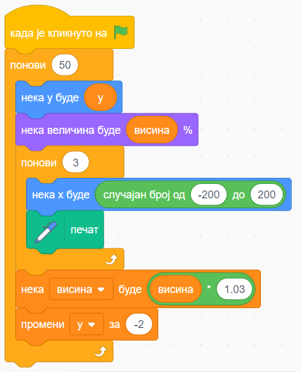

Програмирање слагањем блокова
=============================

У последњих пар деценија покренут је велики број иницијатива са циљем да се омасови и олакша учење програмирања, нарочито за млађе генерације. Једна од најпознатијих таквих иницијатива је програмски језик *Scratch* (Скреч), који је настао 2003. године у једној од истраживачких лабораторија чувеног универзитета *MIT* (ем-ај-ти, Институт за технологију у Масачусетсу). 

Програми у Скречу се састављају уклапањем сличица блокова и по томе они наликују дијаграмима тока. Међутим, за разлику од дијаграма тока, у Скречу се састављају прави програми који су задати потпуно прецизно. Програми се састоје од једне или више скрипти. Свака скрипта настаје склапањем понуђених блокова на одговарајући начин. Блокови који обухватају друге блокове се својом дужином прилагођавају уметнутом садржају. Овако направљене скрипте могу да се покрену и изврше на рачунару. 

Овако изгледа једна скрипта на Скречу:

|

Један од великих проблема у учењу програмирања на стандардним, текстуалним програмским језицима је то што се полазник, практично од самог почетка, суочава са порукама о грешкама. Те грешке могу да буду и прилично неразумљиве, поготово почетницима. Како овакво искуство није баш подстицајно, може се десити да почетници буду фрустрирани и да одустану од даљих покушаја.

Увођење графичких блокова уместо текстуалних записа програма донело је олакшање већ и зато што полазници не морају да уче како се која наредба правилно записује. Међутим, главни добитак је то што овај приступ омогућава да се поруке о грешкама у програму уопште не појављују. Једноставно, шта год саставите - може да се изврши. На тај начин почетна искуства у учењу програмирања су много пријатнија и само програмирање постаје занимљивије. Ова генијална новина је практично донела револуцију у учењу програмирања и Скреч је за кратко време стекао велику популарност. Убрзо су почеле да се појављују и друге платформе са сличним интерфејсом за састављање програма, тако да их сада има више од стотину. Неке од тих платформи су опште намене, а неке су специјализоване за одређену област, на пример креирање мултимедијалних садржаја (веб страна, анимације, звука), или решавање алгоритамских проблема. 

Један од познатијих примера је непрофитна организација *code.org*. На истоименом сајту `code.org <https://code.org>`_ могу се наћи разни задаци за које треба смислити решење и задати га у визуелном (дијаграмском) програмском језику. Почетни задаци су сасвим једноставни, а затим се постепено усложњавају. Свако решење може да се изврши и да се на тај начин провери да ли оно успешно решава постављени задатак. 

Поред оријентације на решавање проблема, још једна важна разлика *code.org* приступа у односу на Скреч је могућност да се корисник који учи да програмира по жељи пребацује из визуелног у текстуални приказ програма и обрнуто. Најпре је подржано пребацивање у програмски језик *JavaScript*, а затим и још неке језике. На тај начин је полазницима омогућен постепени прелазак и навикавање на текстуални програмски језик.

Уколико желите да увежбавате алгоритамско изражавање, или да испољите своју кретаивност, можете да посетите ове сајтове и директно у браузеру (веб прегледачу) да састављате своје програме и решавате задатке.

- скреч: `<https://scratch.mit.edu>`_
- code.org: `<https://code.org>`_