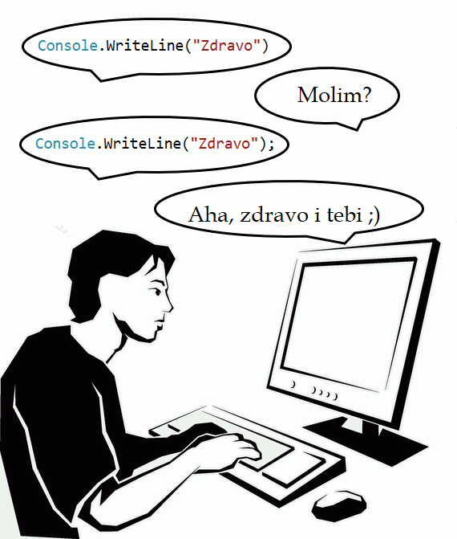
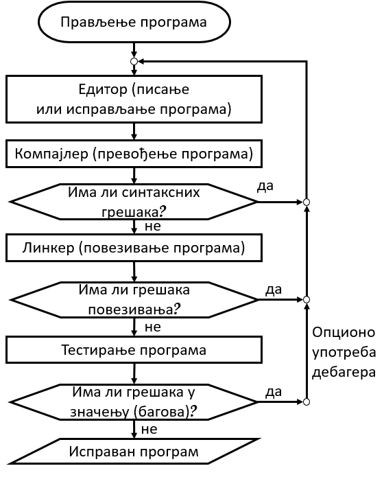

Интегрисано окружење за развој програма
=======================================

За писање програма који ће се извршавати на рачунару потребан је низ алата. Рад на будућим програмима је много удобнији када су сви ти алати спојени у такозвано интегрисано развојно окружење (*integrated development environment*, скраћено *IDE*). За разне програмске језике постоје разна интегрисана окружења за развој програма на тим језицима.

*Visual Studio* је окружење за развој софтвера компаније Microsoft које интегрише развојни интерфејс и све потребне алате за програмирање на неколико програмских језика, међу којима је и *C#*. *Visual Studio Community* представља ограничену и бесплатну верзију окружења *Visual Studio* и може се преузети на адреси: `<https://www.visualstudio.com/downloads/>`_. Након преузимања, потребно је да се покрене извршиви фајл инсталације, а затим да се прате инструкције инсталационог програма. Да би ово окружење могло да се користи, потребно је улоговати се са *Microsoft* налогом, који је бесплатан и једноставно се креира. Овај налог већ имају сви са адресом електронске поште која се завршава на: hotmail.com, live.com ili outlook.com.

У наставку ће бити описани поједини алати развојног окружења које користимо при развоју програма.

Едитор
------

Када започнемо нови пројекат, најпре треба да напишемо (откуцамо) програм. Пошто је програм у суштини текст, потребан нам је програм за уређивање текста, који називамо **едитор** (не енглеском *text editor* значи уређивач текста). Уз *Windows* оперативне системе долази инсталиран један едитор који се зове *Notepad* (бележница, блокчић за белешке) и који сте вероватно користили до сада. Постоји велики број независних едитора који се могу преузети са интернета, од којих су многи прилагођени управо за писање програма, а окружење *Visual Studio*, наравно, има свој уграђен едитор.

Компајлер
---------

Рачунар је у суштини само спој огромног броја електронских (и нешто механичких) компоненти. Посматрајући рачунар на тај начин, и извршавање програма се своди на проток електричних импулса кроз праве компоненте у правом тренутку. Да би рачунар могао да изврши програм, потребно је да га прво из облика у коме смо га написали преведе у облик погодан за извршавање. Облик погодан за извршавање се назива **машински код** и тај код се састоји само од нула и јединица. Неке од тих нула и јединица представљају кодиране инструкције, а неке податке.

**Преводилац** или **компајлер** (*compiler*) је део интегрисаног окружења који преводи програм написан на програмском језику као што је *C#* у машински код. Делови компајлера анализирају *C#* програм и проверавају његову лексичку и синтаксну исправност. У случају да се пронађе и најмања неисправност, компајлер пријављује синтаксну грешку (лексичке грешке се овде пријављују као врста синтаксних грешака - појављивање непознатог симбола). 

Програм са синтаксним грешкама нема никакво значење и зато не може да се преведе у машински код, а тиме ни да се изврши. У том смислу, свеједно је да ли се грешка састоји у само једном погрешно откуцаном или изостављеном знаку, или је цео запис потпуно насумичан - *C#* програм неће моћи да се преведе у машински код и изврши.

Поруке о синтаксним грешкама треба растумачити, затим исправити грешке и поново покренути компајлирање програма. Тек када се програм очисти од синтаксних грешака, може да се компајлира, то јест за њега може да се генерише машински код. 

Линкер
------

Када по завршетку рада компајлера немамо пријављених синтаксних грешака, потребно је још да се добијени машински код доради на местима где се позива кôд из других модула које смо сами написали или користили из стандардних библиотека. Ово повезивање за другим модулима извршава део окружења који се зове повезивач или **линкер** (*linker*). Резултат рада линкера је извршиви програм.

Дебагер
-------

**Тестирање**

Као што је већ речено, у програмима се могу појавити грешке у значењу (семантичке грешке), које се не могу открити формалном анализом програма. Ефективан начин да се провери да ли програм има грешака у значењу (багова) је тестирање програма. Тестирање програма је као када некоме постављамо питања на која знамо одговор. На тај начин проверавамо да ли тај неко оно што говоримо разуме на исти начин као и ми. Ако даје одговор који очекујемо, значи или да смо се лепо разумели, или је неразумевање прошло без последица. Добијање очекиваног одговора није доказ да је комуникација протекла без грешака. На пример, ако знате да је тачно време 6:15, можете желети да тестирате своје знање страног језика тако што некога са тачним сатом питате "Да ли је прошло 6 сати?", али уместо тога погрешно изговорите "Да ли је прошло 5 сати?". На основу одговора "Да, сада је већ 6:15." нећете моћи да приметите да нисте рекли оно што сте намеравали. Да бисте ту своју грешку уочили, потребно је да више разговарате и да током разговора добијете неочекивани одговор. Неочекивани одговор је јасан знак да је било неспоразума, то јест грешака у значењу. 

**Проналажење грешака у програму**

Слична је ситуација и са програмима. Ако за неке улазне податке програм даје очекивани резултат, то не значи да у њему нема багова. Скоро увек је (осим у најједноставнијим случајевима) потребно испробати програм за различите улазне податке да бисмо се уверили у његову исправност, или открили грешке у значењу (багове) које смо направили пишући програм. 

Када нађемо пример улазних података за које програм не даје очекивани одговор, треба открити због чега се то дешава. Понекад је довољно пажљиво гледати у текст програма и пратити у мислима како се извршавају наведене наредбе за дате улазне податке. Ипак, када је програм велики или компликован, тражење бага на овај начин није једноставно. У таквим ситуацијама се користи део окружења који се зове **дебагер** (*debugger*), који нам омогућава да извршавамо програм део по део, или чак наредбу по наредбу и да пратимо ефекте извршених наредби, док не дођемо до наредбе која има неочекивани ефекат. На тај начин смо "локализовали" грешку, па је после тога обично лакше да се разуме зашто до те грешке долази.

.. infonote::

    Док учите програмирање, корисно је да своје програме дајете на тестирање друговима или другарицама са којима учите, односно да тестирате програме које је написао неко други. Смишљање добрих тестова или налажење примера за који програм не ради исправно је важна вештина, која је део знања програмирања. У суштини исте ствари раде и професионални програмери који решавају реалне проблеме. 

Портал `<petlja.org>`_, као и многи други портали, за постављене задатке има унапред припремљене тестове помоћу којих проверава исправност послатих решења. Ово је један облик помоћи свима онима који уче програмирање, да се не би на самом почетку оптерећивали и смишљањем релевантних и квалитетних тестова (јер и неисправан програм може да прође **неке** тестове), али вештину самосталног тестирања програма свакако треба развијати током времена.

~~~~~

Поред наведених и описаних делова, интегрисано окружење може да садржи и разне друге алате, а овде смо поменули само оне најважније, који би требало да се налазе у сваком развојном окружењу.

Поступак стварања једног програма бисмо у грубим цртама могли овако да прикажемо дијаграмом тока:

