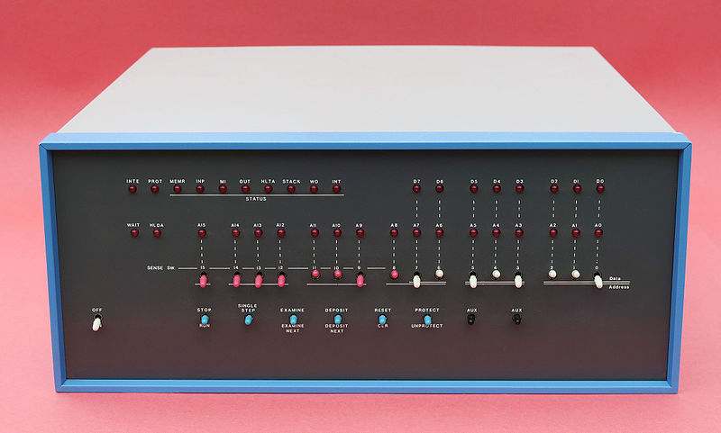
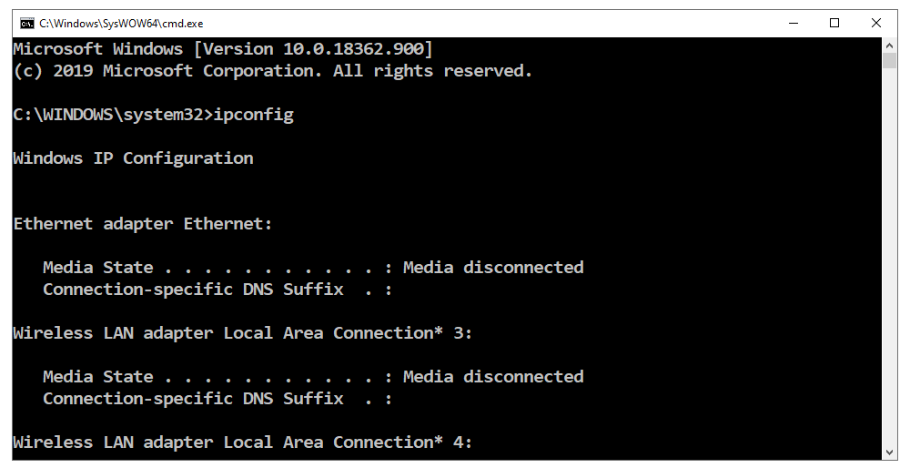
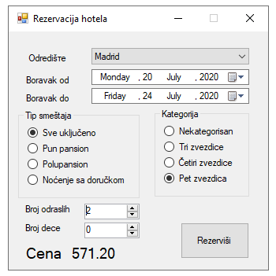

Кориснички интерфејс програма
=============================

У рачунарству, реч **интерфејс** означава начин на који компоненте рачунарског система размењују информације. Информације се могу размењивати између софтверских или хардверских компоненти, као и између човека и рачунара. Интерфејс путем којег човек размењује информације са рачунаром називамо кориснички интерфејс (*user interface*, skraćeno *UI*).

Током развоја рачунара коришћени су различити кориснички интерфејси, који су временом постајали све удобнији за употребу. Примера ради, некада су рачунари на предњој страни кућишта имали панеле са прекидачима и сигналним лампицама помоћу којих су се размењивали подаци између рачунара и корисника.

    (Рачунар ALTAIR 8800, слика преузета са `commons.wikimedia.org <https://commons.wikimedia.org/wiki/File:MITS_Altair_8800_Computer_(1975).jpg>`_)
    
    Атрибуција: Cromemco, CC BY-SA 4.0

Када су монитори масовније ушли у употребу, ни они нису изгледали као данас. У почетку су монитори били монохроматски (приказивали су само једну боју, обично зелену или амбер-наранџасту) и превасходно су коришћени за приказ текста. Графику је било могуће приказати, али се за смештање слике користила меморија опште намене, јер је било скупо уграђивати посебну меморију само за слику. Осим тога, употреба графике је подразумевала више посла за процесор у вези са интерфејсом, што је значило спорије обављање других послова. Због тога су многи програми избегавали да користе графику и интерфејс је углавном био текстуални - све команде су морале да буду откуцане (графика је углавном коришћена у играма).

Интерфејс командне линије
-------------------------

Из времена монохроматских монитора су нам остали програми са интерфејсом командне линије (*command line interface*, скраћено *CLI*, у српском језику се понекад по аналогији користи скраћеница КЛИ, са значењем: командно-линијски интерфејс). Такви програми су некада користили цео екран у текстуалном режиму (није било прозора на екрану). У данашње време, када покренемо програм са интерфејсом командне линије, он отвара такозвани конзолни прозор (као на слици испод) у коме може да се приказује само текст. Надаље се сва комуникација са програмом обавља преко тог прозора: програм исписује текстуалне поруке, а ми уносимо текстуалне податке (често бројеве).

|

Мада су у међувремену разрађени удобнији интерфејси за интерактиван рад, интерфејс командне линије и данас има своје предности. Овај тип интерфејса је погодан када нема потребе за великом разменом података између програма и корисника. Програме са КЛИ програмери пишу углавном за себе и друге програмере, или за напредне кориснике.

Типичан пример мале размене података између корисника и рачунара је аутоматска обрада велике количине података, што је увек била једна од најважнијих примена рачунара. Када се обрађује велики број података, они се не уносе интерактивно. Уместо тога улазни подаци су најчешће смештени у један или више фајлова, а и резултат рада завршава у фајловима. У пракси се често покрећу обраде сличне претходним (само са новим подацима, или другачијим параметрима обраде), па није ретко да се и подешавања обраде такође задају унапред, на пример тако што се сачувају у конфигурационом фајлу. Конфигурациони фајл типично садржи информације о томе где се налазе подаци за обраду, на који од унапред дефинисаних начина треба обрадити податке, где треба сместити резултат, где уписати извештај о обради (лог фајл) и слично. На тај начин, комуникације корисника са програмом готово да и нема, можда је једино потребно навести путању до конфигурационог фајла.

Приликом учења програмирања КЛИ има ту предност да је врло једноставан и употреба таквог интерфејса из програма се врло брзо савладава. То нам на почетку учења омогућава да се усредсредимо на суштински важније теме, а то су алгоритми за решавање проблема.

Графички кориснички интерфејс
-----------------------------

Графички кориснички интерфејс (ГКИ, енгл. *Graphics User Interface* скраћено *GUI*) је данас и даље најраспрострањенији облик интерфејса, поготово на десктоп рачунарима. Овај интерфејс је једноставнији за употребу, јер не морамо да знамо како гласе и како се тачно пишу команде које желимо да извршимо. За ГКИ је типична употреба миша или екрана осетљивих на додир (зависно од уређаја), па је уз овај тип интерфејса број корисника рачунара знатно порастао. ГКИ успешно користе и људи без икаквог предзнања, а у неким примерима и мала деца која још нису научила да читају и пишу, што са интерфејсом командне линије не би било могуће.

|

ГКИ и КЛИ су кориснички интерфејси који су данас највише у употреби, али нису једини који се користе.

.. infonote::
    
    **Кориснички интерфејси следеће генерације**

    У последње време улазе у употребу нове врсте корисничких интерфејса, који као улазне податке користе гласовне команде, одређене покрете руке, шаке или главе, гестове, поглед итд. На пример, паметни телефони могу да позову особу из именика на захтев гласом, што је врло згодно током вожње. Такође, кућни рачунар у такозваним паметним кућама може (поред многих других ствари) да на захтев гласом закључа врата, што је опет практично ако излазимо из стана или куће заузетих руку. Играчке конзоле помоћу камера (бар две) региструју гестове и покрете тела, а затим их анализирају и тумаче. 
    
    Ова област се брзо развија и извесно је да ће у не тако далекој будућности кориснички интерфејси бити знатно другачији од оних које данас познајемо. Можемо очекивати да нови кориснички интерфејси буду све једноставнији за употребу, али да ће захтевати додатни хардвер и софтвер и бити знатно захтевнији за процесорском снагом од оних који су сада најзаступљенији.

У овом курсу нам је од суштинског значаја савладавање различитих алгоритама, па нам у ту сврху највише одговара једноставан интерфејс какав имају програми са КЛИ. Изучавањем графичког корисничког интерфејса се нећемо бавити у оквиру овог курса, а заинтересовани за програмирање графичког корисничког интерфејса могу по жељи да користе приручник `C# програмирање графичког корисничког интерфејса <https://petlja.org/biblioteka/r/kursevi/gui_cs-sr-cyrl>`_ . У том приручнику је дат довољан број решених и објашњених примера да се разумеју и усвоје основни принципи функционисања таквог интерфејса. Како је ГКИ веома богат, његово детаљније изучавање могло би да однесе много времена на уштрб важнијих тема (а и даље би било далеко од комплетног).
