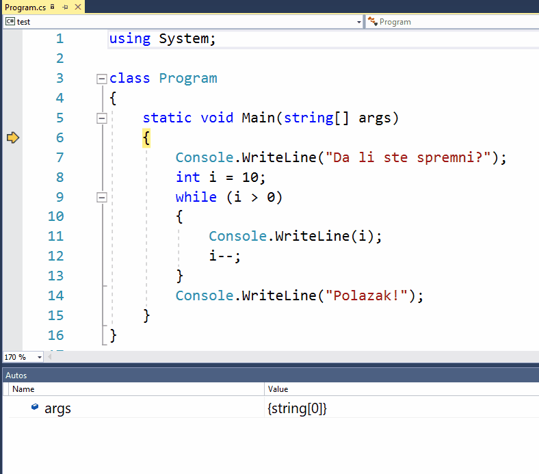

Врсте петљи
===========

У приручнику `Увод у програмирање у програмском језику C# <https://petljamediastorage.blob.core.windows.net/root/Media/Default/Kursevi/spec-it/csharpprirucnik.pdf>`_ погледајте поглавља 4.1, 4.2 и 4.3 (стране 57-68).

~~~~

Рекли смо да су петље наредбе које омогућавају понављање других наредби. То значи да су петље сложене наредбе, које у себи могу да садрже друге наредбе. Уместо речи петља често се користи и реч циклус (у програмирању су овде речи синоними). На следећем примеру ћемо показати како се користи свака од три врсте петљи које постоје у језику C#.

.. questionnote::

    Скратити следећи програм коришћењем петље.
    
    .. code-block:: csharp
    
        using System;

        class Program
        {
            static void Main(string[] args)
            {
                Console.WriteLine("Da li ste spremni?");
                Console.WriteLine("10");
                Console.WriteLine("9");
                Console.WriteLine("8");
                Console.WriteLine("7");
                Console.WriteLine("6");
                Console.WriteLine("5");
                Console.WriteLine("4");
                Console.WriteLine("3");
                Console.WriteLine("2");
                Console.WriteLine("1");
                Console.WriteLine("Polazak!");
            }
        }

Десет наредби које исписују бројеве од 10 до 1 ћемо заменити петљом, у којој ће се за свако *i* од 10 до 1 исписати број *i*. Тиме ћемо добити програм који је краћи, а самим тим и јаснији јер не морамо да пазимо да ли је написан баш сваки број од 10 до 1, да ли су по реду, да ли се неки поновио (било случајно или намерно) итд. Осим тога, програм са петљом је лакше и преправити да одбројава другачије, али о томе више касније.

While петља
-----------

Општи облик *while* наредбе је:

.. code-block:: csharp

    while (uslov)
        telo

Ова наредба дословно значи: "док је испуњен услов, извршавај тело". Овде *uslov* представља било какав израз логичког типа, дакле нешто што је тачно или нетачно (има вредност *true* или *false*), а *telo* представља једну или више било којих наредби језика *C#*. Ако у телу петље има више наредби, оне морају бити окружене витичастим заградама. 

Према томе, уместо наредби које исписују бројеве од 10 до 1, можемо равноправно писати и ове наредбе (учинак је исти):

.. code-block:: csharp

    int i = 10;
    while (i > 0)
    {
        Console.WriteLine(i);
        i--;
    }

Након што променљивој *i* доделимо вредност 10, долазимо до *while* наредбе, која се извршава овако:

.. code::

    1.      израчуна се услов (i > 0); i је тренутно 10 и јесте веће од 0. Услов петље је испуњен и зато се прелази на тело петље.
            1 a) исписује се вредност i, тј. број 10
            1 b) i се смањује за 1 и постаје 9
        
    2.      израчуна се услов (i > 0); i је тренутно 9 и веће је од 0. Прелази се на тело петље.        
            2 a) исписује се вредност i, тј. број 9
            2 b) i се смањује за 1 и постаје 8
        
    ...

    10.     израчуна се услов (i > 0); i је тренутно 1 и веће је од 0. Прелази се на тело петље.
            10 a) исписује се вредност i, тј. број 1
            10 b) i се смањује за 1 и постаје 0
        
    11.     израчуна се услов (i > 0); i је тренутно 0 и услов више није испуњен. Прелази се на наредбу после тела петље.

Овако изгледа комплетан програм:

.. activecode:: od_10_do_1_while
    :passivecode: true
    :coach:
    :includesrc: _src/petlje/od_10_do_1_while.cs

Да бисте што боље разумели како овај програм ради, можете да га прекуцате или копирате у ваш *Visual Studio* пројекат, а затим да га извршавате корак по корак (наредбу по наредбу), тако што притискате тастер *F10*. На сваки притисак на тастер *F10* се извршава по једна наредба. 

.. topic:: Важна вежба:

    Док извршавате програм корак по корак, гледајте у прозор који се зове *Autos* (обично је испод прозора са кодом програма) и пратите у њему како се мења вредност променљиве *i*. 
    
    Пре извршавања сваке наредбе предвидите (у себи) шта ће се тачно догодити, то јест која ће бити вредност променљиве и на коју наредбу ће се прећи као следећу. Посебно, настојте да предвидите када ће се са линије 9 скочити на линију 14.

For петља
---------

Општи облик петље `for` је:

.. code-block:: csharp

    for (inicijalizacija; uslov; korak)
        telo
    
Овако написана *for* наредба ради исто што и

.. code-block:: csharp

    inicijalizacija
    while(uslov)
    {
        telo
        korak
    }

Значи, прво се извршава наредба коју смо овде назвали *inicijalizacija*, затим се проверава услов и док год је он испуњен, понављају се тело петље и наредба коју смо назвали *korak*. Тако, уместо  
    
.. code-block:: csharp

    int i = 10;
    while (i > 0)
    {
        Console.WriteLine(i);
        i--;
    }
    
можемо равноправно да пишемо    
    
.. code-block:: csharp

    for (int i = 10; i > 0; i--)
        Console.WriteLine(i);
    
Сада је вероватно јасније зашто смо наредбе *inicijalizacija* и *korak* тако назвали. Мада на месту ових наредби могу да се пишу било које наредбе језика *C#*, најчешће на месту наредбе *inicijalizacija* додељујемо некој променљивој (почетну) вредност, а у наредби *korak* ту вредност мењамо. При томе се вредност променљиве врло често мења само за по један навише или наниже, као и у нашем примеру, али промена у ствари може да буде било каква: за по два или више (чак и не увек исту вредност), може да укључи множење или дељење и тако даље - можемо да изаберемо било који начин који нам одговара.

У примерима попут овог, где треба поновити неку наредбу или наредбе за сваку вредност променљиве из одређеног интервала, *for* наредба нам даје нешто сажетији запис у коме је комплетно контролисање вредности преоменљиве у једном реду програма. Зато се овакав пример чешће решава помоћу *for* петље, него помоћу *while* петље.
    
Комплетан програм са *for* петљом изгледа овако:

.. activecode:: od_10_do_1_for
    :passivecode: true
    :coach:
    :includesrc: _src/petlje/od_10_do_1_for.cs

.. topic:: Важна вежба:

    Извршите и овај програм корак по корак (на исти начин као претходни) и пажљиво испратите редослед извршавања наредби и њихових делова, као и тренутке када се мења вредност променљиве.

Do-while петља
--------------

Општи облик `do-while` петље је:

.. code-block:: csharp

    do
        telo
    while (uslov)

Овде *telo* поново представља једну или више наредби, а *uslov* представља логички израз (израз који има вредност *true* или *false*). Ако се тело петље састоји од више наредби, оне и у овом случају морају бити окружене витичастим заградама.

Овако написана *do-while* наредба ради исто што и 

.. code-block:: csharp

    telo
    while (uslov)
        telo

Приметимо да се *do-while* петља разликује од *for* и *while* петље између осталог и по томе што се прво изврши тело петље па се проверава да ли је испуњен услов за понављање. Другим речима, тело *while* или *for* петље може да се не изврши ни једном (а то се дешава када услов на почетку има вредност *false*), док се тело *do-while* петље увек извршава бар једном, без обзира на услов.

Комплетан програм који решава постављени задатак помоћу *do-while* петље изгледа овако:

.. activecode:: od_10_do_1_do_while
    :passivecode: true
    :coach:
    :includesrc: _src/petlje/od_10_do_1_do_while.cs

.. topic:: Важна вежба:

    Поновите још једном поступак извршавања програма корак по корак и пратите вредност променљиве и редослед извршавања наредби.

Питања за проверу знања
-----------------------

.. mchoice:: vrste_petlji_1
   :answer_a: једна или више наредби које се понављају у тој петљи
   :answer_b: "while", "for" или "do-while"
   :answer_c: витичасте заграде
   :correct: a
   :feedback_a: Тачно!
   :feedback_b: Не.
   :feedback_c: Не.
		
   Тело петље је ...

.. mchoice:: vrste_petlji_2
   :answer_a: даље дешавање зависи од тога о којој врсти петље се ради
   :answer_b: петља завршава са радом и прелази се на наредбу после тела петље
   :answer_c: извршава се тело петље
   :correct: c
   :feedback_a: Не.
   :feedback_b: Не.
   :feedback_c: Тачно!
		
   Када услов петље има вредност true ...

.. mchoice:: vrste_petlji_3
   :answer_a: while
   :answer_b: do-while
   :answer_c: for
   :correct: b
   :feedback_a: Не.
   :feedback_b: Тачно!
   :feedback_c: Не.
		
   Тело које петље се увек извршава бар једном?

Задаци за вежбу
---------------

Употребу петљи у програмима можете почети да вежбате на `овим <https://arena.petlja.org/sr-Latn-RS/competition/skola-od-kuce-petlje-01>`_ задацима.
