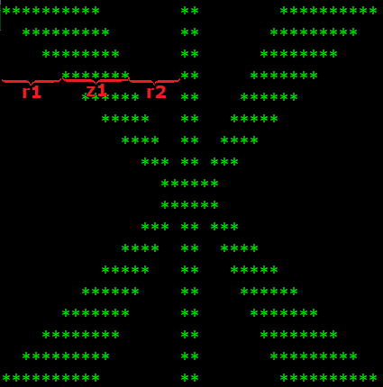

Угнежђене петље - ASCII графика
===============================

Помоћу угнежђених петљи можемо да формирамо цртеже који се састоје од карактера. У време када рачунарска графика није била развијена као данас, прављење оваквих сличица је било прилично популарно. Испоставило се да је формирање једноставних цртежа помоћу карактера веома добар начин за увежбавање употребе уметнутих петљи, па ћемо и ми искористити ову тему да прођемо кроз неколико таквих примера.

.. questionnote::

    **Пример - квадрат.** Написати програм који приказује оквир квадратног облика, формиран од по :math:`n` звездица дуж сваке стране квадрата. На пример, за :math:`n = 4` програм треба да прикаже:
    
    .. code::
    
        ****
        *  *
        *  *
        ****
    
Решићемо задатак на два начина. У првом решењу користимо једну двоструку петљу, у којој помоћу ``if`` наредбе одлучујемо да ли исписујемо звездицу или размак. Ако бројимо редове и колоне од 1 до :math:`n`, услов да треба исписати звездицу је да смо у првом или последњем реду, или у првој или последњој колони.

.. activecode:: ugnp_ASCII_11_PrazanKvadrat_uslovi
    :passivecode: true
    :coach:
    :includesrc: _src/petlje/ugnp_ASCII_11_PrazanKvadrat_uslovi.cs

У другом решењу не користимо ``if`` наредбу. Уместо тога, цртање квадрата разлажемо у три етапе:

- најпре помоћу једне петље исписујемо ред звездица, 
- затим помоћу двоструке петље исписујемо :math:`n-2` реда који почињу и завршавају звездицом а између тих звездица је по :math:`n-2` размака, 
- на крају поново помоћу једне петље исписујемо ред звездица.
    
.. activecode:: ugnp_ASCII_12_PrazanKvadrat_intervali
    :passivecode: true
    :coach:
    :includesrc: _src/petlje/ugnp_ASCII_12_PrazanKvadrat_intervali.cs

.. questionnote::

    **Пример - икс.** Написати програм који у пољу од :math:`n` редова и :math:`n` колона помоћу звездица приказује облик слова *X*. Празна места у квадрату треба попунити тачкама. На пример, за :math:`n = 7` програм треба да прикаже:
    
    .. code::

        *.....*
        .*...*.
        ..*.*..
        ...*...
        ..*.*..
        .*...*.
        *.....*    

Један начин да решимо задатак је да уведемо две променљиве које ће памтити позиције звездица у текућем реду. У нашем програму, то су променљиве ``z1`` и ``z2``. У првом реду звездице су на позицијама 1 и ``n``, па су то почетне вредности за ``z1`` и ``z2``. У сваком следећем реду, звездица са позиције ``z1`` се помера једно место десно, а звездица са позиције ``z2`` једно место лево. Зато након исцртавања једног реда ``z1`` повећавамо за 1, а ``z2`` смањујемо за 1.

.. activecode:: ugnp_ASCII_21_X_uslovi_z1z2
    :passivecode: true
    :coach:
    :includesrc: _src/petlje/ugnp_ASCII_21_X_uslovi_z1z2.cs

Врло сличан начин, али без увођења додатних променљивих је да искористимо редни број реда и колоне за формирање услова. Уз мало анализирања долазимо до следећег закључка:

- дуж једне линије слова *X* (то јест једне дијагонале квадрата), редни бројеви реда и колоне су међусобно једнаки
- дуж друге линије слова *X* (друге дијагонале), збир редних бројева реда и колоне је једнак :math:`n+1`

Сада услове за исписивање звездице формирамо користећи ове релације између редних бројева реда и колоне.

.. activecode:: ugnp_ASCII_22_X_uslovi_rk
    :passivecode: true
    :coach:
    :includesrc: _src/petlje/ugnp_ASCII_22_X_uslovi_rk.cs

.. questionnote::

    **Пример - слово А.** Написати програм који у пољу од :math:`n` редова и :math:`2n` колона (:math:`n` се задаје) помоћу звездица приказује облик слова *A*. Део изнад хоризонталне линије је приближно два пута виши него део испод линије. Празна места треба попунити тачкама. На пример, за :math:`n = 7` програм треба да прикаже:
    
    .. code::
    
        ......**......
        .....*..*.....
        ....*....*....
        ...*......*...
        ..**********..
        .*..........*.
        *............*

Поново можемо да употребимо променљиве ``z1`` и ``z2``, које овај пут прате косе линије слова *A*, што ће нам поједноставити писање провере да ли треба приказати звездицу или тачку.

Косе линије почињу од позиција ``z1 = n`` и ``z2 = n+1`` и на даље се прва помера за по једно место на лево, а друга на десно. Поред двеју косих, имамо и једну водоравну линију. Водоравна линија се налази у реду коме одговара индекс ``n - n / 3``, а при томе само у делу између косих линија. Према томе, услов да карактер у реду ``red`` и колони ``kol`` припада водоравној линији слова *A* гласи ``(red == n - n / 3 && kol > z1 && kol < z2)``. Комбинујући овај услов са условима за припадање косим линијама, добијамо комплетан услов за исцртавање звездице.

.. activecode:: ugnp_ASCII_3_A
    :passivecode: true
    :coach:
    :includesrc: _src/petlje/ugnp_ASCII_3_A.cs

.. questionnote::

    **Пример - слово Ж.** Написати програм који помоћу звездица приказује стилизовано слово *Ж* задате величине :math:`n`. Слика се састоји од :math:`2n` редова. У првом реду налази се редом :math:`n+1` звездица, затим :math:`n-1` размак, две звездице, поново :math:`n-1` размак и :math:`n+1` звездица. О броју размака и звездица у осталим редовима закључити са слике, која одговара величини :math:`n = 4`.

    .. code::
        
        *****   **   *****
          ****  **  ****
            *** ** ***
              ******
              ******
            *** ** ***
          ****  **  ****
        *****   **   *****

Да бисмо могли да нацртамо ову релативно сложену слику, треба прво да је проанализирамо. Посматрајући било који ред карактера, примећујемо да се у њему појављује прво :math:`r_1` размака, затим редом :math:`z_1` звездица, :math:`r_2` размака, две звездице, затим поново :math:`r_2` размака и на крају још :math:`z_1` звездица (види слику).

|

Погледајмо како се величине :math:`r_1`, :math:`z_1` и :math:`r_2` мењају током извршавања програма.

- у првом реду слике је :math:`r_1 = 0`, :math:`z_1 = n+1`, :math:`r_2=n-1`;
- после сваког од првих :math:`n-1` редова :math:`r_1` се повећава за 2, а :math:`z_1` и :math:`r_2` се смањују за по 1;
- после :math:`n`-тог реда нема промена (:math:`n+1`-ви ред је исти као :math:`n`-ти);
- после :math:`n+1`-вог и наредних редова се :math:`r_1` смањује за 2, а :math:`z_1` и :math:`r_2` се повећавају за по 1;

На основу ових запажања можемо да напишемо следећи програм.

.. activecode:: ugnp_ASCII_4_Puno_zh
    :passivecode: true
    :coach:
    :includesrc: _src/petlje/ugnp_ASCII_4_Puno_zh.cs

Ово је први програм у коме видимо неколико узастопних петљи, заједно угнежђених у једну која их све обухвата. Овакав распоред петљи иначе није ништа необично, а у наредним програмима се може, наравно, појавити и било који други распоред.

|

.. questionnote::

    **Пример - Петљин лого.** Написати програм који помоћу звездица приказује *Петљин* лого **</>**, смештен у :math:`2n` редова и :math:`3n+2` колоне (сваки од карактера ``<``, ``/`` и ``>`` заузима по :math:`n` колона и по једна колона раздваја карактере). На пример, за :math:`n = 6` програм треба да прикаже:

    .. code::

             *      * *
            *       *  *
           *       *    *
          *        *     *
         *        *       *
        *         *        *
        *        *         *
         *       *        *
          *     *        *
           *    *       *
            *  *       *
             * *      *

Решење има доста сличности са решењима претходних задатака. Покушајте да га разумете без додатних објашњења.

.. activecode:: ugnp_ASCII_5_PetljaLogo2
    :passivecode: true
    :coach:
    :includesrc: _src/petlje/ugnp_ASCII_5_PetljaLogo2.cs

~~~~

Након што одговорите на питања у вези са овом лекцијом, пређите на задатке да бисте провежбали формирање цртежа који се састоје од карактера.
