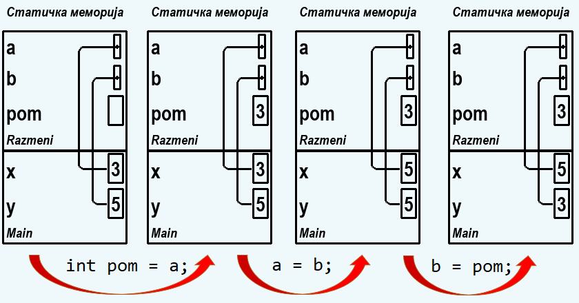
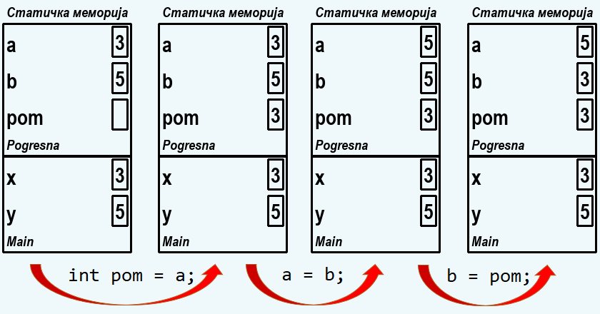

Пренос аргумената по референци
==============================

У приручнику `Увод у програмирање у програмском језику C# <https://petljamediastorage.blob.core.windows.net/root/Media/Default/Kursevi/spec-it/csharpprirucnik.pdf>`_ погледајте поглавље 5.6 (стране 129-136).

~~~~

Читајући поменуто поглавље приручника, видели смо да параметри метода могу да послуже и за уношење вредности у метод, али и за изношење вредности из њега. Ако испред параметара не употребимо никакве додатне ознаке, такви параметри могу само да унесу вредности у метод. То је начин употребе какав смо до сада упознали и користили.

Када желимо да наш метод може преко параметара и да изнесе вредности, користимо специјалну реч ``ref`` или специјалну реч ``out``. За сваки параметар појединачно можемо да користимо једну, другу или ниједну од ове две речи (не могу се користити обе за исти параметар). Ако одлучимо да за неки параметар користимо једну од ових речи, пишемо је испред типа и имена тог параметра у заглављу метода, а такође и испред имена одговарајућег стварног аргумента на месту сваког позива. При томе и стваран аргумент мора да буде променљива (не може да буде константа или израз), да би вредност која се износи из метода имала где да буде сачувана.

Коришћење речи ref
------------------

Писањем речи ``ref`` испред неког параметра, омогућавамо да тај параметар и уноси вредност у метод и да износи (исту или другу) вредност из њега. На примеру метода ``Razmeni`` видимо како се користи реч ``ref`` испред аргумената метода.

.. code-block:: csharp

    static void Razmeni(ref int a, ref int b)
    {
        int pom = a;
        a = b;
        b = pom;
    }

    static void Main(string[] args)
    {
        int x = 3;
        int y = 5;
        Razmeni(ref x, ref y);
        Console.WriteLine("{0} {1}", x, y);
    }

У методу ``Razmeni`` параметрима ``a`` и ``b`` су промењене вредности. Извршавањем програма можемо по исписаном резултату да се уверимо да се те промене вредности параметра одражавају и на стварне аргументе ``x`` и ``y``. Да би било сасвим јасно да реч ``ref`` испред параметара овде има кључну улогу, упоредимо резултате овог и следећег, сличног програма, у коме се реч ``ref`` не користи:

.. code-block:: csharp

    static void Pogresna(int a, int b) {
        int pom = a;
        a = b;
        b = pom;
    }

    static void Main(string[] args)
    {
        int x = 3;
        int y = 5;
        Pogresna(x, y);
        Console.WriteLine("{0} {1}", x, y);
    }

Резултат рада овог програма је исти као да функција ``Pogresna`` није ни позвана (исписује се 3 па 5). Закључак је да функција ``Pogresna`` не омогућава изношење вредности преко аргумената.

Подсетимо се: програм можемо да извршавамо и корак по корак, притисцима на тастер *F11*. На тај начин имамо прилику да пратимо шта се дешава са променљивама током извршавања програма. У прозору *Call Stack* (стек позива) видимо све методе чије извршавање је започето, а вредности аргумената и променљивих метода који се тренутно извршава пратимо у прозору *Autos*.

У следећој галерији је приказано корак по корак како се извршавају методи ``Pogresna`` и ``Razmeni``. 

.. gallery:: 12_fun_ref_razmeni
    :width: 800px
    :height: 100%
    :folder: ..\..\_images\animacije
    :images: 12_fun_ref_razmeni_001.png, 12_fun_ref_razmeni_002.png, 12_fun_ref_razmeni_003.png, 12_fun_ref_razmeni_004.png, 12_fun_ref_razmeni_005.png, 12_fun_ref_razmeni_006.png, 12_fun_ref_razmeni_007.png, 12_fun_ref_razmeni_008.png, 12_fun_ref_razmeni_009.png, 12_fun_ref_razmeni_010.png, 12_fun_ref_razmeni_011.png, 12_fun_ref_razmeni_012.png

При извршавању метода ``Razmeni``, промена вредности се дешава директно на променљивама ``x`` и ``y`` метода ``Main``, јер је овај метод употребом речи ``ref`` добио директан приступ тим променљивама. 

.. infonote::

    Када користимо специјалну реч ``ref``, кажемо да се **аргументи преносе по референци**, јер се у метод преносе референце на стварне аргументе, то јест метод добија референцу - информацију где се налази стварни аргумент. 
    
У шематском приказу меморије на слајдовима 8, 9, 10 и 11 претходне анимације приказан је пренос аргумената по референци. Ови слајдови одговарају стању пре и после извршења сваке од наредби метода ``Razmeni``:

|

.. infonote::

    Када не користимо специјалне речи ``ref`` или ``out`` испред имена аргумената, кажемо да се **аргументи преносе по вредности** (у метод се преносе вредности аргумената, то јест вредности се преписују - копирају на друго место у меморији).

Ово значи да метод ``Pogresna`` преко аргумената добија копије променљивих ``x`` и ``y``. Зато измена њихових вредности у методу ``Pogresna`` нема утицаја на оригинале. На слајдовима 2, 3, 4 и 5 претходне анимације шематски је приказан пренос аргумената по вредности. Слајдови одговарају стању меморије током извршавања наредби метода ``Pogresna``.

Промене су се догодиле само у стек-оквиру метода ``Pogresna``, који ће по завршетку рада метода бити уништен (тај простор се ослобађа), па ће и те промене бити "заборављене".

Коришћење речи out
------------------

Реч ``out`` користимо када желимо да одређени параметар служи само за изношење вредности из метода, а не и за уношење вредности у метод. Писањем ``out`` уместо ``ref`` испред параметра поставили смо себи два нова ограничења:

- у току рада метода морамо да доделимо вредност оваквом параметру.
- у методу не смемо да користимо вредност таквог параметра пре него што му доделимо вредност у самом методу

Уколико се не придржавамо ових ограничења, програм неће моћи да се преведе у извршиви код и покрене. 

Тиме што смо употребили реч ``out`` и себи добровољно наметнули ова ограничења, постигли смо две ствари. Као прво, помогли смо себи јер ће нас окружење (компајлер) упозорити ако омашком не поставимо вредност параметру који је чисто излазни, или покушамо да користимо вредност таквог параметра пре постављања у методу (није битно да ли је стварни аргумент иницијализован пре позива метода). Као друго, свима који читају програм ће бити јасније како намеравамо да користимо параметре о којима је реч, па ће лакше разумети и цео програм.

Где год користимо реч ``out`` испред имена параметра, можемо да је заменимо речју ``ref`` и програм ће радити једнако добро. Међутим, ако већ намеравамо да неки параметар користимо као чисто излазни, боље је да то јасно кажемо тако што користимо реч ``out`` (а не ``ref``) испред имена таквог параметра. На тај начин добијамо и приликом писања програма (компајлер нам помаже код једне врсте пропуста) и касније (мање објашњавамо како програм ради).

Употреба речи ``out`` испред имена аргумената не уводи неку нову врсту преноса аргумената. Аргументи се увек преносе или по вредности (копирају се) или по референци (прослеђује се информација о томе где је оригинал). Када користимо реч ``out``, аргументи се и у овом случају преносе по референци, што можемо да закључимо по томе што метод мења вредности оригиналних променљивих, које се налазе ван метода (то јест, на месту позива). Разлика у односу на ``ref`` је само у томе што смо се (у свом интересу) одрекли пуне слободе у коришћењу тих оригиналних променљивих, односно обавезали смо се на описани начин коришћења. 

| 

Типична ситуација у којој желимо да употребимо чисто излазне параметре је када неки поступак даје више од једног резултата. У таквим случајевима можемо и један од резулатата да вратимо као вредност метода а остале као излазне параметре. Ако није сасвим јасно који резултат је најважнији, а који су споредни, можемо и да користимо ``void`` метод и све резултате да вратимо преко излазних параметара.

У следећем примеру, у методу ``NadjiMax`` се, за *n* целих бројева које ће метод учитати, израчунава највећи од њих и број његових појављивања. При томе је ``n`` параметар који се преноси по вредности и може се користити само за улаз у метод, док су остала два параметра чисто излазна.

.. activecode:: metodi_out_parametri
    :passivecode: true
    :coach:
    :includesrc: _src/metodi/metodi_out_parametri.cs

Покушајте да изоставите наредбу ``brPoj = 1;`` пре петље у методу и да покренете програм. Када би такав програм могао да се изврши, он не би давао исправан резултат. Зато је добро што нам компајлер не дозвољава да такав програм уопште покренемо, јер ћемо на тај начин лакше наћи грешку. Да смо користили реч ``ref`` уместо ``out``, програм би могао да се покрене и можда не бисмо ни приметили да је неисправан, или би нам требало више труда и времена да откријемо грешку.