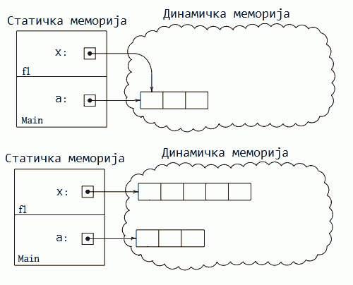
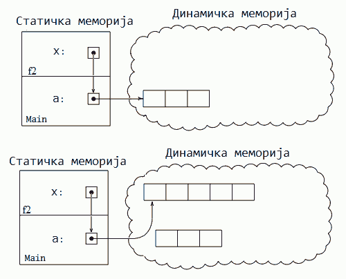

Низ као референцирани тип
=========================

У приручнику `Увод у програмирање у програмском језику C# <https://petljamediastorage.blob.core.windows.net/root/Media/Default/Kursevi/spec-it/csharpprirucnik.pdf>`_ прочитајте поглавља 6.2 и 6.4 (стране 146-150 и 157-169).

~~~~

Као што смо видели у поменутим поглављима приручника, у језику C# постоје **вредносни** и **референцирани** типови података, а низ је први референцирани тип података са којим се сусрећемо. 

Референцирани типови функционишу другачије од вредносних. Разлике између вредносних и референцираних типова треба добро разумети и упамтити, да бисмо избегли разне врсте грешака у раду са низовима.

Подразумевана почетна вредност
------------------------------

У језику *C#* свака променљива која није иницијализована експлицитно (наредбом у програму), биће иницијализована имплицитно, тј. биће јој аутоматски додељена подразумевана вредност за њен тип. Тако неиницијализоване целобројне и реалне променљиве аутоматски добијају почетну вредност ``0``, стрингови вредност ``""`` (празан стринг), логичке променљиве вредност ``false``, а низови (и други референцирани типови) вредност ``null``. Вредност ``null`` означава празну референцу, тј. значи да низу (још) није додељена меморија и он нема никакав садржај. Другим речима, декларације низова

.. code-block:: csharp

    int[] a;

и 

.. code-block:: csharp

    int[] a = null;

су равноправне.

**Напомена 1:** Без обзира на то што су све променљиве на почетку програма иницијализоване (било имплицитно или експлицитно), *C#* компајлер инсистира да локалним променљивама експлицитно доделимо вредност пре него што их употребимо. Ако напишемо програм у коме се користи локална променљива која није експлицитно иницијализована, програм не може да се преведе и покрене.

**Напомена 2:** Особина да се имплицитно додељује подразумевана почетна вредност свим променљивама углавном се разликује од језика до језика, па ако програмирате и у другим програмским језицима, треба да проверите каква правила важе у њима у вези са имплицитном иницијализацијом. Правила могу да буду (и често јесу) различита за локалне и глобалне променљиве, односно статичка поља класе.

Оператори поређења
------------------

Од оператора поређења, на низове се могу применити оператори ``==`` и ``!=`` (оператори ``<``, ``>``, ``<=`` i ``>=`` нису дефинисани за низове). При томе треба имати на уму да се овим операторима пореде референце, а не садржај низова. Тако на пример, након наредби

.. code-block:: csharp

    int[] a = { 1, 2, 3 };
    int[] b = { 1, 2, 3 };

тачно је ``a != b`` а не ``a == b``. Мада имају исти садржај, ова два низа се  разликују као референце. То значи да ова два низа користе различите делове динамичке меморије за свој садржај.

Обрнуто, када за низове ``a`` и ``b`` важи ``a == b``, то значи да су ``a`` и ``b`` једнаки као референце, то јест да користе исти простор у динамичкој меморији. Суштински, имамо један низ са два имена. У том случају, мењањем на пример ``a[1]`` мења се и ``b[1]`` (и обрнуто), јер је ``b[1]`` само још једно име за простор у меморији који заузима вредност ``a[1]``.

Оператор додељивања
-------------------
 
Слично претходном, оператор ``=`` примењен на низове означава додељивање референце а не садржаја. То значи да извршавањем наредби

.. code-block:: csharp

    int na = int.Parse(Console.ReadLine());
    int[] a = new int[na];
    int nb = int.Parse(Console.ReadLine());
    int[] b = new int[nb];
    a = b;

``a`` постаје друго име низа ``b``. Након последње наредбе додељивања (``a = b;``), ``a`` указује на садржај који може бити другачије дужине од садржаја на који је ``a`` претходно указивао. Актуелну дужину низа ``a`` у сваком тренутку можемо да добијемо као ``a.Length``.

Погледајмо у галерији како то изгледа у шематском приказу меморије.

.. gallery:: 22_niz_dodela
    :width: 800px
    :height: 100%
    :folder: ..\..\_images\animacije
    :images: 22_niz_dodela_001.png, 22_niz_dodela_002.png, 22_niz_dodela_003.png, 22_niz_dodela_004.png, 22_niz_dodela_005.png, 22_niz_dodela_006.png, 22_niz_dodela_007.png, 22_niz_dodela_008.png

Видимо да је меморија на коју је првобитно указивао низ ``a`` остала без референци. Таква меморија постаје недоступна програму, али остаје заузета још неко време. У неком тренутку, такву, нереференцирану меморију проналази посебан систем за ослобађање меморије која се више не користи. Овај систем се на енглеском зове *Garbage Collector*, што можемо да преведемо као сакупљач отпадака, или слободније - ђубретарац. Након што овај систем обави свој посао, та меморија може поново да се резервише и користи.

Када желимо да направимо независну копију низа ``b`` (а не само друго име за исти низ у меморији), треба писати:

.. code-block:: csharp

    int[] a = new int[b.Length];
    for (int i = 0; i < b.Length; i++)
        a[i] = b[i];

Краћи начин да направимо копију низа је

.. code-block:: csharp

    int[] a = (int[])(b.Clone());

|

Због ове, вероватно неочекиване особине оператора ``=`` за низове, делује да од наредбе ``a = b`` и нема неке користи. Заиста, зашто бисмо једном низу давали два имена? Разлози ипак постоје, а ево неких примера:

- Желимо да низови ``a`` и ``b`` размене садржај. Кратак начин да то постигнемо је

.. code-block:: csharp

    int[] c = a;
    a = b;
    b = c;

Ово је и знатно ефикасније од премештања свих појединачних чланова низа.

- Желимо да обавимо нека израчунавања над дужим од низова ``a`` и ``b``. То можемо да урадимо овако:

.. code-block:: csharp

    int[] c;
    if (a.Length >= b.Length)
        c = a;
    else
        c = b;

    // ... operacije nad nizom c

- Неки поступак полазећи од једног низа формира нови низ, који је нпр. дужи за један елемент него полазни низ. Желимо да на неки полазни низ ``n`` пута узастопно применимо тај поступак. То можемо да урадимо овако:

.. code-block:: csharp

    int[] polazni;
    // ... formiranje ili ucitavanje polaznog niza
    
    for (int i = 0; i < n; i++)
    {
        int[] novi = new int[polazni.Length + 1];
        // ... racunanje elemenata novog niza na osnovu polaznog
        polazni = novi;
    }
    
Поменимо узгред да би, уз нешто сложенији поступак, могло да се избегне алоцирање унутар петље, које производи доста посла за "ђубретарца", али би то идеју коју овде излажемо учинило мање јасном.

Низ као аргумент метода
-----------------------

Пошто је низ референцирани тип, низ као аргумент метода се понаша као ново име за исти простор у динамичкој меморији. Метод који добије низ као аргумент, преко тог новог имена истог низа може да трајно мења вредности елемената низа (промене остају и након завршетка рада метода).

На пример, метод ``NapuniNiz`` поставља вредност свим елементима низа (уписује у њих редом квадрате природних бројева).

.. code-block:: csharp

    static void NapuniNiz(int[] a) {
        for (int i = 0; i < a.Length; i++)
            a[i] = (i + 1) * (i + 1);
    }

Тестирањем овог метода можемо се уверити да елементи низа заиста остају измењени и када метод заврши са радом. Према томе, за промену вредности елемената низа помоћу метода **није потребно** да користимо реч ``ref`` испред низа као аргумента. 

Следећа галерија показује стање у меморији током извршавања  метода ``NapuniNiz``. Посебно обратите пажњу на слајд 8. Он показује да и за време извршавања метода ``NapuniNiz`` можемо да изаберемо да гледамо оквир стека који одговара некој од претходних функција у стеку позива. На пример, двокликом на метод ``Main`` у прозору *Call Stack* прелазимо на оквир овог метода у стеку позива, па се у прозору *Autos* виде променљиве метода ``Main``. На тај начин се и пре завршетка метода ``NapuniNiz`` уверавамо да он мења вредности у оригиналном низу ``kvadrati`` метода ``Main``, тј. да су низ ``kvadrati`` метода ``Main`` и низ ``a`` метода ``NapuniNiz`` у ствари исти низ.

.. gallery:: 31_fun_niz_popuni
    :width: 800px
    :height: 100%
    :folder: ..\..\_images\animacije
    :images: 31_fun_niz_popuni_001.png, 31_fun_niz_popuni_002.png, 31_fun_niz_popuni_003.png, 31_fun_niz_popuni_004.png, 31_fun_niz_popuni_005.png, 31_fun_niz_popuni_006.png, 31_fun_niz_popuni_007.png, 31_fun_niz_popuni_008.png, 31_fun_niz_popuni_009.png, 31_fun_niz_popuni_010.png

Низ као повратна вредност метода
--------------------------------

Метод се може декларисати и тако да као резултат враћа низ. Типично је то нови низ који је формиран током рада метода. У поглављу 6.4 `Приручника <https://petljamediastorage.blob.core.windows.net/root/Media/Default/Kursevi/spec-it/csharpprirucnik.pdf>`_ смо као пример видели метод ``Segment``, који формира и враћа нови низ.

.. code-block:: csharp

    static double[] Segment(double[] A, int p, int L) {
        double[] B = new double[L];
        for(int i = 0; i < L; i++) {
            B[i] = A[p + i];
        }   
        return B;
    }

Метод не мора да формира нови низ, већ може као резултат да врати и неки од низова који су му прослеђени као аргументи. Тако метод ``Min`` (чији код је дат ниже) враћа онај од својих аргумената који је мањи у лексикографском смислу, то јест онај код кога је први различит елемент мањи (ако нема различитих елемената, мањи низ је онај који је краћи). На пример, од низова {1, 2, 3} и {1, 2, 1, 4} мањи је други јер су им елементи на позицијама 0 и 1 једнаки, а елемент на позицији 2 је мањи у другом низу.

.. code-block:: csharp

    static int[] Min(int[] a, int[] b)
    {
        int i = 0;
        while (i < a.Length && i < b.Length && a[i] == b[i])
            i++;

        if (i == a.Length) return a;
        if (i == b.Length) return b;
        if (a[i] < b[i]) return a;
        return b;
    }

Када метод враћа низ као резултат, враћа се само референца и не долази до копирања елемената низа (слично као при додељивању вредности). Према томе, методи враћањем низа као резултата не доводе до додатног успоравања програма и не треба се устручавати од писања и употребе таквих метода.

У следећем примеру, метод ``NapraviNiz`` формира нови низ задате дужине, попуњава га квадратима природних бројева и враћа га као резултат.

.. code-block:: csharp

    static int[] NapraviNiz(int n) {
        int[] a = new int[n];
        for (int i = 0; i < a.Length; i++)
            a[i] = (i + 1) * (i + 1);
        return a;
    }

Погледајмо у галерији анимацију извршавања програма са овим методом уз шематски приказ меморије.

.. gallery:: 32_fun_niz_napravi
    :width: 800px
    :height: 100%
    :folder: ..\..\_images\animacije
    :images: 32_fun_niz_napravi_001.png, 32_fun_niz_napravi_002.png, 32_fun_niz_napravi_003.png, 32_fun_niz_napravi_004.png, 32_fun_niz_napravi_005.png, 32_fun_niz_napravi_006.png, 32_fun_niz_napravi_007.png, 32_fun_niz_napravi_008.png, 32_fun_niz_napravi_009.png, 32_fun_niz_napravi_010.png, 32_fun_niz_napravi_011.png, 32_fun_niz_napravi_012.png, 32_fun_niz_napravi_013.png, 32_fun_niz_napravi_014.png, 32_fun_niz_napravi_015.png, 32_fun_niz_napravi_016.png

Пренос низа по референци
------------------------

Већ је речено и показано на примеру да се низ преноси по референци, па када пишемо метод који мења вредности елемената низа није потребно писати реч ``ref``. 

Можемо се запитати шта се догађа ако ипак напишемо реч ``ref`` испред низа као аргумента метода. Да ли је то грешка, и да ли уопште има неке последице? Другим речима, која је разлика између

.. code-block:: csharp

    static void f(int[] A) { ... }

и

.. code-block:: csharp

    static void f(ref int[] A) { ... }
 
Најједноставнији начин да разумемо у чему је разлика је пример. Погледајмо зато шта исписује следећи програм:

.. code-block:: csharp

    using System;

    class Program
    {
        static void f1(int[] x) 
        {
            x = new int[5];
        }
        static void f2(ref int[] x) 
        {
            x = new int[5];
        }

        static void Main(string[] args)
        {
            int[] a = { 1, 2, 3 };
            Console.WriteLine(a.Length);
            f1(a);
            Console.WriteLine(a.Length);
            f2(ref a);
            Console.WriteLine(a.Length);
        }
    }

Извршавањем добијамо бројеве 3, 3 и 5. Дакле, метод ``f1`` није променио дужину полазног низа, а метод ``f2`` јесте. 

Као што смо научили на примеру метода ``NapuniNiz``, метод ``f1`` може да мења садржај динамичке меморије на коју указује његов аргумент. Међутим, ако метод ``f1`` свом аргументу додели нову меморију, то не утиче на оригиналну референцу ``a``, која и даље указује на исту меморију као и пре позива метода ``f1``. То је зато што је метод ``f1`` добио само *копију референце* на динамичку меморију која садржи бројеве 1, 2 и 3. Следећа слика показује стање меморије пре и после извршења наредбе ``x = new int[5];`` у методу ``f1``

       
|

У случају метода ``f2``, аргумент се преноси по референци. Пошто је низ референцирани тип, то значи да је метод ``f2`` добио **референцу на референцу**. Зато он може да утиче на оригиналну референцу ``a`` и да је усмери на други део динамичке меморије, као што показује следећа слика стања меморије пре и после реалокације низа ``x`` у методу ``f2``.

Због тога последња ``WriteLine`` наредба исписује број 5.

У галерији је приказано корак по корак се извршавање овог програма уз шематски приказ меморије:

.. gallery:: 41b_fun_niz_po_ref
    :width: 800px
    :height: 100%
    :folder: ..\..\_images\animacije
    :images: 41b_fun_niz_po_ref_001.png, 41b_fun_niz_po_ref_002.png, 41b_fun_niz_po_ref_003.png, 41b_fun_niz_po_ref_004.png, 41b_fun_niz_po_ref_005.png, 41b_fun_niz_po_ref_006.png, 41b_fun_niz_po_ref_007.png, 41b_fun_niz_po_ref_008.png, 41b_fun_niz_po_ref_009.png, 41b_fun_niz_po_ref_010.png

~~~~

У пракси се низ врло ретко преноси на овакав начин, а претходни пример је дат пре свега зато да бисмо у потпуности разумели који је ефекат речи ``ref`` испред низа као аргумента метода. Уколико вам је потребан метод који ће низу доделити нову меморију, јасније и уобичајеније решење је метод који враћа низ као резултат, као што то раде методи ``Segment`` и ``NapraviNiz``.

У случају да баш желите метод који алоцира више од једног низа и хоћете да то урадите преко аргумената пренесених по референци, било би добро да у коментару испред метода нагласите своју намеру. На тај начин појашњавате да нисте реч ``ref`` написали омашком или због непознавања њеног дејства (што није ретко), а помажете и оним читаоцима вашег програма који слабије познају *C#*, а можда боље неки сличан језик у коме нема речи ``ref``.
