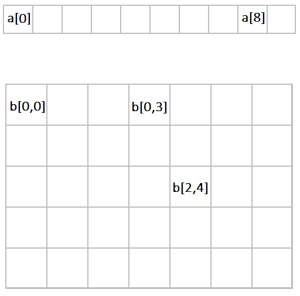

Матрице
=======

Најкраће речено, матрице су дводименизиони низови. Низови и матрице имају многе заједничке особине (садрже елементе међусобно истог типа, заузимају простор у динамичкој меморији итд.). Најважнија разлика између низова и матрица је у томе што за приступ елементу низа користимо један индекс, а за приступ елементу матрице два. На следећој слици видимо графички приказ

- низа ``а`` од 10 елемената и 
- матрице ``b`` од 35 елемената (распоређених у 5 редова и 7 колона).

Елемент низа је одређен својим редним бројем, а елемент матрице редним бројевима реда и колоне у којима се налази. Као и код низова, редове и колоне код матрица бројимо од 0. Редни број реда се наводи први у угластим заградама, а редни број колоне други (после зареза).

|

У лекцијама које следе, научићемо како се матрица декларише, алоцира и иницијализује, а затим ћемо вежбати употребу матрица у решавању алгоритамских проблема.
