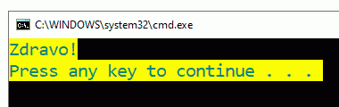

Набројиви типови
================

Набројиви тип је у суштини списак вредности које могу да добију променљиве тог типа. Дефиниција сваког набројивог типа почиње кључном речју ``enum``, иза које следи име типа (које можемо да изаберемо, поштујући правила) а затим у витичастим заградама имена константи тог типа. 

**Пример 1 - Боје**

У системској библиотеци (у именском простору ``System``) постоји овако дефинисан тип ``ConsoleColor``

.. code-block:: csharp

    public enum ConsoleColor
    {
        Black = 0,
        DarkBlue = 1,
        DarkGreen = 2,
        DarkCyan = 3,
        DarkRed = 4,
        DarkMagenta = 5,
        DarkYellow = 6,
        Gray = 7,
        DarkGray = 8,
        Blue = 9,
        Green = 10,
        Cyan = 11,
        Red = 12,
        Magenta = 13,
        Yellow = 14,
        White = 15
    }

Вредности овог типа се употребљавају за задавање боје слова и позадине у нашим конзолским програмима, на пример:

.. activecode:: enum_boja_teksta
    :passivecode: true
    :coach:
    :includesrc: _src/korisnicki_tipovi/enum_boja_teksta.cs

|

Као што видимо, приликом приказивања текста у конзолском прозору програм користи вредности својстава ``Console.ForegroundColor`` и ``Console.BackgroundColor``. Ова својства класе ``Console`` су набројивог типа ``ConsoleColor``, па им у овом кратком примеру и додељујемо вредности типа ``ConsoleColor`` и тиме бирамо боју текста и позадине. 

Конзолски прозор може да користи горе набројане боје за позадину и текст, а те боје се у рачунару региструју као бројеви од 0 до 15. Било би нам неудобно када би се у програму налазили бројеви уместо назива боја: када пишемо програм, морали бисмо да памтимо (или да се подсећамо) који број означава коју боју, а када читамо програм ситуација би била још мало гора, јер можда не бисмо ни разумели да се ради о боји.

.. infonote::

    Поента увођења набројивих типова је у томе да се разне целобројне константе именују на систематичан начин, у складу са контекстом и значењем, тако да програми буду једноставнији и за писање и за разумевање. На основу само бројчане вредности често нам не би било јасно ни зашто се на одређеном месту у коду налази дати број, док је на основу имена константе по правилу јасан и контекст и конкретно значење дате именоване константе. 

На пример, програм је сигурно јаснији када пишемо ``ConsoleColor.Yellow`` уместо 14, мада смо уместо писања

.. code-block:: csharp

    Console.BackgroundColor = ConsoleColor.Yellow;

могли да користимо експлицитну конверзију (каст) и пишемо

.. code-block:: csharp

    Console.BackgroundColor = (ConsoleColor)14;

Делује да би у оваквим ситуацијама стрингови могли да послуже једнако добро као и набројиви типови. На пример, ако бисмо боје задавали помоћу стрингова ``"red"``, ``"blue"`` и слично, програми би били једнако јасни као и са набројивим типовима. Ипак, такав приступ има више мана, од којих ћемо поменути две:

- Код сложенијих имена довољно је погрешити за једно слово (што се врло лако догоди) па да програм не ради исправно. При томе је програм синтаксно исправан и може да се покрене, а тражење грешке може да одузме доста времена (зависно од искуства, познавања кода, величине програма итд.). Подсетимо се, увек је боље да грешке које правимо буду синтаксне, а не семантичке, јер синтаксне грешке открива сам рачунар (то јест `C#` компајлер), а погрешно написано име константе (нпр. константе набројивог типа) је синтаксна грешка.
- Баратање целобројним величинама је знатно ефикасније него баратање стринговима у програму. Пошто се вредности набројивих типова интерно представљају целим бројевима, поменута употреба стрингова би непотребно успорила програм.

|

**Пример 2 - Начин заокруживања**

У именском простору ``System`` постоји и набројиви тип ``MidpointRounding``, који је дефинисан овако:

.. code-block:: csharp

    public enum MidpointRounding
    {
        ToEven = 0,
        AwayFromZero = 1
    }

Вредност овог типа се појављује као последњи параметар у неким облицима метода ``Math.Round`` и служи да зада на који начин желимо да се обави заокруживање када је број који заокружујемо једнако далеко од два могућа резултата. Вредност ``ToEven`` значи да треба применити правило парне цифре, а вредност ``AwayFromZero`` да треба заокружити на број који је даљи од нуле. Тако, на пример, следећи програм 

.. activecode:: enum_zaokruzivanje
    :passivecode: true
    :coach:
    :includesrc: _src/korisnicki_tipovi/enum_zaokruzivanje.cs

исписује бројеве 3 и 2, јер је први пут примењено заокруживање на број даљи од нуле, а други пут на парну цифру.

|

**Пример 3 - Поређење стрингова**

Извршите следећи програм

.. activecode:: enum_poredjenje_stringova
    :passivecode: true
    :coach:
    :includesrc: _src/korisnicki_tipovi/enum_poredjenje_stringova.cs

Потражите на интернету додатне информације о набројивом типу ``StringComparison``. Које све константе припадају овом типу? Које је њихово значење? Објасните резултат извршавања програма.

~~~~

Поред типова ``ConsoleColor``, ``MidpointRounding`` и ``StringComparison``, у стандардној библиотеци корисницима је изложено још `пар хиљада набројивих типова <https://docs.microsoft.com/en-us/dotnet/api/system.enum?view=netcore-3.1>`_ најразличитијих намена. Одавде је јасно да је употреба набројивих типова врло широко распрострањен принцип. Са набројивим типовима смо се већ спорадично сусретали и до сада, а при интензивнијем коришћењу библиотеке тих сусрета ће бити све више.

Креирање набројивих типова
--------------------------

Своје набројиве типове можемо да уведемо на потпуно исти начин као у претходним примерима из библиотеке, а затим да те типове користимо у програмима које пишемо. Ово постаје утолико значајније уколико су програми већи, јер је са растом програма потребно улагати све више труда око јасноће програма. Нарочито је важно да интерфејс (начин позивања метода) буде што јаснији и једноставнији.

Пример - табела
'''''''''''''''

У примеру који следи програм исцртава табелу попут неке од ових:

.. code::

    ╔═════════╦═════════╦═════════╗    ┌─────┬─────┬─────┬─────┬─────┬─────┬─────┐
    ║         ║         ║         ║    │     │     │     │     │     │     │     │
    ║         ║         ║         ║    │     │     │     │     │     │     │     │
    ╠═════════╬═════════╬═════════╣    ├─────┼─────┼─────┼─────┼─────┼─────┼─────┤
    ║         ║         ║         ║    │     │     │     │     │     │     │     │
    ║         ║         ║         ║    │     │     │     │     │     │     │     │
    ╠═════════╬═════════╬═════════╣    ├─────┼─────┼─────┼─────┼─────┼─────┼─────┤
    ║         ║         ║         ║    │     │     │     │     │     │     │     │
    ║         ║         ║         ║    │     │     │     │     │     │     │     │
    ╠═════════╬═════════╬═════════╣    └─────┴─────┴─────┴─────┴─────┴─────┴─────┘
    ║         ║         ║         ║
    ║         ║         ║         ║
    ╚═════════╩═════════╩═════════╝

У програму смо дефинисали набројиви тип ``StilOkvira``, који описује стил оквира табеле.

.. code-block:: csharp

    public enum StilOkvira
    {
        Jednostruki,
        Dvostruki,
        PrviRedDvostruki,
        PrvaKolonaDvostruki,
    }

У методу ``Tabela`` користимо параметар овог типа да задамо стил оквира који желимо да употребимо. Онај ко позива овај метод не мора да зна ништа о томе који карактери се користе за исцртавање оквира, ни о томе како је метод имплементиран. Довољно је задати димензије табеле, димензије поља и стил оквира (погледајте позиве метода ``Tabela`` на крају програма).

Поменимо и то да свакој константи у набројивом типу појединачно можемо, а и не морамо да експлицитно доделимо целобројну вредност. Када је из неког разлога важно да константе имају тачно одређене целобројне вредности, додељујемо их исто као што је то урађено у дефиницијама библиотечких типова ``ConsoleColor`` и ``MidpointRounding``. Константа којој није експлицитно додељена вредност, добија вредност за један већу од вредности претходне константе. Када првој константи у типу није експлицитно додељена вредност, она добија вредност 0. Пошто нама за ову намену није битно које су бројчане вредности константи типа ``StilOkvira``, оставили смо да оне имплицитно добију вредности 0, 1, 2 и 3 редом.

.. activecode:: enum_tabela
    :passivecode: true
    :coach:
    :includesrc: _src/korisnicki_tipovi/enum_tabela.cs

Извршавањем програма требало би да добијете следећи излаз:

.. code::

    ┌─────┬─────┬─────┬─────┐
    │     │     │     │     │
    │     │     │     │     │
    ├─────┼─────┼─────┼─────┤
    │     │     │     │     │
    │     │     │     │     │
    ├─────┼─────┼─────┼─────┤
    │     │     │     │     │
    │     │     │     │     │
    └─────┴─────┴─────┴─────┘

    ╔═════╦═════╦═════╦═════╗
    ║     ║     ║     ║     ║
    ║     ║     ║     ║     ║
    ╠═════╬═════╬═════╬═════╣
    ║     ║     ║     ║     ║
    ║     ║     ║     ║     ║
    ╠═════╬═════╬═════╬═════╣
    ║     ║     ║     ║     ║
    ║     ║     ║     ║     ║
    ╚═════╩═════╩═════╩═════╝

    ╒═════╤═════╤═════╤═════╕
    │     │     │     │     │
    │     │     │     │     │
    ╞═════╪═════╪═════╪═════╡
    │     │     │     │     │
    │     │     │     │     │
    ├─────┼─────┼─────┼─────┤
    │     │     │     │     │
    │     │     │     │     │
    └─────┴─────┴─────┴─────┘

    ╓─────╥─────┬─────┬─────┐
    ║     ║     │     │     │
    ║     ║     │     │     │
    ╟─────╫─────┼─────┼─────┤
    ║     ║     │     │     │
    ║     ║     │     │     │
    ╟─────╫─────┼─────┼─────┤
    ║     ║     │     │     │
    ║     ║     │     │     │
    ╙─────╨─────┴─────┴─────┘
