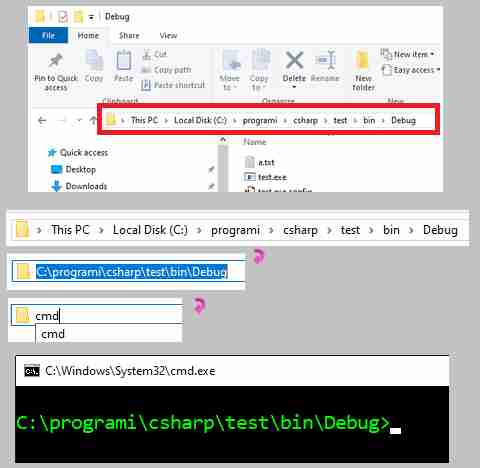
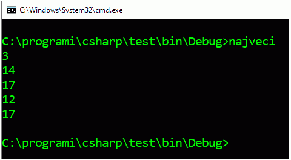
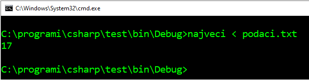
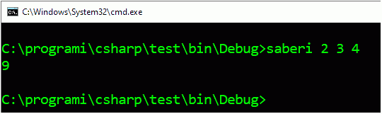
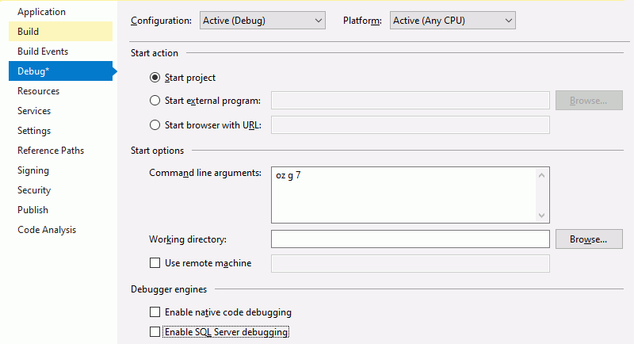

Аргументи командне линије програма
==================================

Програм са интерфејсом командне линије може да се покрене двокликом на његову икону, као и сваки други програм. Овако покренут програм ће отворити свој командни прозор и у њему ће прихватати улазне податке и исписивати резултате. Оперативни систем ће, међутим, затворити командни прозор када програм заврши са радом, па може да се догоди да не стигнемо да прочитамо оно што је програм исписао. Већ због тога је при употреби оваквих програма природније прво отворити командни прозор, па у том прозору покренути програм куцањем његовог имена.

Командни прозор можемо да отворимо из програма `Windows explorer` у изабраном фолдеру, тако што у простор за уписивање путање (`address bar`) упишемо команду `cmd`.

Овакво извршавање програма са интерфејсом командне линије доноси још неке погодности, које ћемо сада упознати.

Преусмеравање стандардног улаза и излаза
----------------------------------------

Стандардни улаз за конзолне програме је, наравно, тастатура. Оперативни систем рачунара нам омогућава да приликом покретања програма преусмеримо стандардни улаз за тај програм са тастатуре на фајл који изаберемо. То значи да ће програм који је написан тако да учитава податке са тастатуре, у ствари учитавати податке из фајла "мислећи" да они стижу са тастатуре.

Узмимо као пример сасвим једноставан програм, који проналази и исписује највећи од `n` датих бројева.

.. activecode:: redirect_najveci
    :passivecode: true
    :coach:
    :includesrc: _src/fajlovi/redirect_najveci.cs

Као што смо рекли, програм можемо да покренемо куцањем његовог имена у командној линији. Након тога уносимо податке (у примеру испод `n` је 3, а бројеви су 14, 17 и 12), а програм исписује резултат (17) и завршава са радом.

Испробајмо сада преусмеравање стандардног улаза. Најпре треба да направимо фајл са улазним подацима, који изгледа нпр. овако:

.. code::

    3
    14
    17
    12

Ово можемо да урадимо из окружења `Visual Studio` или било ког програма за уређивање текста (едитора текста). Сачувајмо фајл под именом ``podaci.txt`` у фолдеру у коме се налази и програм. Ако сада у командном прозору после имена програма откуцамо ``< podaci.txt``, програм ће уместо са тастатуре, да учитава податке из фајла `podaci.txt`.

|

На врло сличан начин можемо да преусмеримо и стандардни излаз. Довољно је да у командном прозору после имена програма откуцамо, на пример ``> rezultat.txt``. У том случају, програм ће учитавати податке са тастатуре, а исписивати их у фајл `rezultat.txt`.

Наравно, могуће је за исто извршавање програма преусмерити и стандардни улаз и стандардни излаз. Ако у командном прозору напишемо

.. code::

    najveci < podaci.txt > rezultat.txt

програм ће користити фајлове и за улаз и за излаз.

Овакав начин покретања програма је нарочито згодан када програме покрећемо из другог програма и желимо да процес у потпуности аутоматизујемо.

Програми који очекују аргументе у командној линији
--------------------------------------------------

Слична, али суштински сасвим различита могућност је писање програма који анализирају садржај командне линије из које су позвани, па на основу тог садржаја усмеравају даљи ток свог извршавања.

Код таквих програма метод ``Main`` има низ стрингова као аргумент:

.. code-block:: csharp

    using System;

    class Program
    {
        public static void Main(string[] args)
        {
            ...

Наставак командне линије (након имена програма) ће бити растављен размацима на делове (као када користимо метод ``Split``) и ти делови ће бити елементи низа ``args``. Уколико желимо да неки аргумент садржи један или више размака, треба користити наводнике, на пример:

.. code::

    ime_programa arg1 "arg2 sa razmacima" arg3

Пример - Сабирач
''''''''''''''''

.. questionnote::

    Написати програм који исписује збир свих бројева наведених у командној линији (после имена програма).

Програм може да се напише овако:

.. activecode:: cmdarg_saberi
    :passivecode: true
    :coach:
    :includesrc: _src/fajlovi/cmdarg_saberi.cs

Покренимо сада програм из командне линије, наводећи неколико целих бројева након имена програма:

|

Видимо да програм не очекује никакав додатни улаз са тастатуре, већ одмах исписује збир бројева наведених у командној линији.

.. infonote::

    Многи програми са интерфејсом командне линије очекују додатне инструкције управо као аргументе у командној линији. Такви су, на пример, програми за компресију података (`pkzip`, `7zip` и слични), програм `git` за управљање верзијама изворног кода, програм `grep <https://sr.wikipedia.org/wiki/Grep>`_ (који је много познатији на `unix/linux` оперативним системима него на `Windows` системима) и многи други. Такви програми, ако их покренемо без додатних параметара, обично исписују могуће начине употребе и одговарајуће аргументе командне линије. Иста упутства најчешће добијамо и када покренемо програм са опцијом ``-h``, ``/h`` или ``--help``.

Програме попут описаних можемо да правимо и сами, на начин који смо већ видели у примеру сабирања бројева из командне линије.

Пример - Претварач величина
'''''''''''''''''''''''''''

.. questionnote::

    Написати програм који прерачунава величине из једних јединица мере у друге. Програм треба да прихвата три аргумента из командне линије, и то: јединицу мере у којој је дата величина, јединицу мере у коју треба прерачунати величину и сама величина.
    
    У програму користити ознаке за јединице мере наведене ниже.
    
    - Јединице мере за дужину: `mm` (милиметар), `cm` (центиметар), `m` (метар), `km` (километар), `in` (инч), `ft` (стопа), `yd` (јард), `mi` (миља, тј. копнена миља), `nmi` (морска, или наутичка миља)
    - Јединице мере за масу: `g` (грам), `kg` (килограм), `oz` (унца), `lb` (фунта), `t` (тона)
    - Јединице мере за запремину: `ml` (милилитар), `l` (литар), `m3` (кубни метар), `in3` (кубни инч), `ft3` (кубна стопа), `pt` (пинта - `pint`), `qt` (кварт - `quart`), `gal` (галон - `gallon`), `bbl` (барел - `barrel`)

    Пример употребе може да изгледа овако:
    
    .. image:: ../../_images/fajlovi/cmdarg_pretvori.png
        :width: 580px
        :align: center 
        
    При неправилној употреби програм треба да испише какве аргументе прихвата у командној линији.

Називе јединица за дужину смештамо у низ ``jediniceDuzine``, за масу у низ ``jediniceMase``, а за запремину у ``jediniceZapremine``. Вредности тих јединица изражене у одговарајућим основним јединицама чувамо у пратећим низовима реалних бројева (``velicineDuzine``, ``velicineMase``, ``velicineZapremine``).

Користимо метод ``Pretvori``, који у низу назива јединица који му је прослеђен покушава да нађе полазну и циљну јединицу. Ако нађе обе јединице, метод израчунава и поставља тражену вредност у ``out`` параметар. Вредност коју метод враћа указује на исход тражења јединица (да ли су нађене обе, само једна, само друга, или ниједна од задатих јединица).

У главном делу програма прво се проверава да ли је број аргумената у командној линији одговарајући и аргументи се преузимају у променљиве одговарајућег типа. Након тога се позива метод ``Pretvori`` редом за дужине, масе и запремине, док не пронађе бар једну од задатих јединица. На крају, у зависности од исхода тражења, програм исписује резултат или одговарајућу поруку.

.. activecode:: cmdarg_pretvori
    :passivecode: true
    :coach:
    :includesrc: _src/fajlovi/cmdarg_pretvori.cs

Један начин тестирања програма је покретање у командном прозору, као што је приказано у поставци задатка. Осим тога, програм са аргументима у командној линији се може тестирати и у окружењу `Visual Studio`. Ово је веома згодно нпр. када програме овог типа треба требити од грешака (багова) извршавањем део по део.

Да бисмо у радном окружењу задали аргументе командне линије, потребно је да отворимо дијалог `Project properties` (`Својства пројекта`), нпр. помоћу менија `Project → Properties`, или двокликом на `Properties` испод назива пројекта у прозору `Sloution Explorer`. 

У менију на левој страни дијалога треба изабрати `Debug`, а затим у пољу `Command line agruments:` унети аргументе командне линије, као што бисмо то учинили при покретању програма у командном прозору.

.. comment

    GIT
    **git log** 
    **git add**
    **git commit**

     
     7z a primeri.zip *.*
     7z l primeri.zip
     7z x primeri.zip
